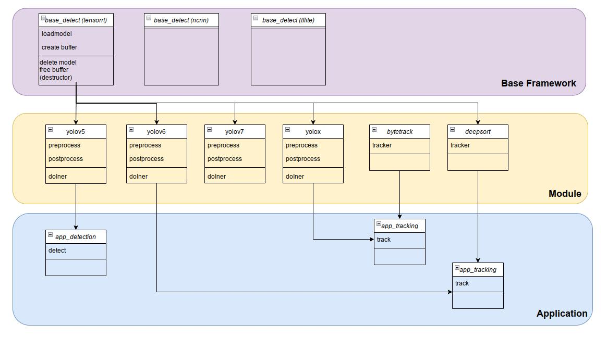

# BaseDetect
This repo provide code for newly AI model serving written in Tensorrt APIs (C++).

[Yolov5](https://github.com/ultralytics/yolov5) [Yolov6](https://github.com/meituan/YOLOv6) [Yolov7](https://github.com/jinfagang/yolov7) [YoloX](https://github.com/Megvii-BaseDetection/YOLOX)



## Dependencies 
+ tensorrt
+ opencv
+ eigen


## First, build base_detect:

```
cd base_detect/build && cmake .. && sudo make install && cd ../..
```
then build model, ex yolox:
```
cd yolox/build && cmake .. && sudo make install && cd ../..
```
and build tracking algorithm, ex bytetrack:
```
cd bytetrack/build && cmake .. && sudo make install && cd ../..
```
and build test code
```
cd test/build && cmake .. && make 
```
## Or simply run setup bash file 
```
bash setup.bash
```

## Download 
assets and checkpoints [here](https://drive.google.com/drive/folders/1XQ9Of7hJ32aYhHaY-k-g2B-mJVwb1xYb?usp=sharing) (tensorrt 8.4) 

## Finally, test model
```
cd test/build 
./det_yolox ../../zidane.jpg ../../test.jpg

./det_yolox ../../palace.mp4 ../../test.mp4

./track_bytetrack_yolox ../../palace.mp4 ../../test.mp4
```

## For new model, first check size of input and output
```
./new_model ../../model.engine
```
put the size of model in the model config (.cpp file)
```
/******************* model configuration **********************/
#define DEVICE 0
// model config
const string model_path = "../../new_model.engine";
int inputw = 640;   // change here
int inputh = 640;   // chane here
float nms_thresh = 0.4;
float conf_thresh = 0.5;
```

## Model convert from .onnx -> .engine
```
cd /usr/src/tensorrt/bin
./trtexec --onnx=path_to_onnx_model --saveEngine=path_to_save_engine_model --fp16 --verbose
```
In case of yolov5, you should convert from .pt file using the released version >=6.0 (the older released version may not work well)

With yolov7.pt -> yolov7.onnx, convert without nms (remove flag --end2end), identical to [Yolov6](https://github.com/meituan/YOLOv6). From [Yolov7](https://github.com/WongKinYiu/yolov7).
```
python export.py --weights yolov7.pt --grid --simplify --topk-all 100 --img-size 640 640 --max-wh 640
```

## Int8 quantization (coming soon)

## The results

